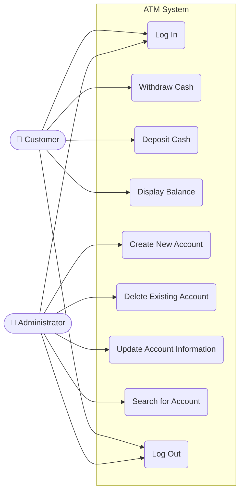
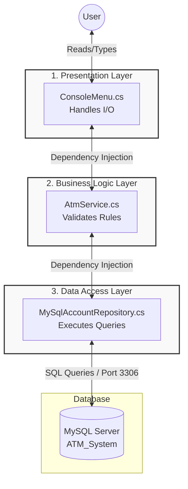

# ATM System Architecture

## 1. Use Case Diagram



## 2. System Architecture Diagram



## 3. Class Diagram

```mermaid
classDiagram
    %% Models
    class Account {
        +int AccountId
        +string Login
        +string PinCode
        +string Role
        +string HolderName
        +decimal Balance
        +string Status
        +UpdateBalance(decimal newBalance) void
    }

    %% Data Access Layer
    class IAccountRepository {
        <<interface>>
        +GetAccountByLoginAndPin(string login, string pin) Account?
        +GetAccountById(int accountId) Account?
        +UpdateAccountBalance(int accountId, decimal newBalance) void
    }

    class MySqlAccountRepository {
        -string _connectionString
        +MySqlAccountRepository(string connectionString)
        +GetAccountByLoginAndPin(string login, string pin) Account?
        +GetAccountById(int accountId) Account?
        +UpdateAccountBalance(int accountId, decimal newBalance) void
    }

    %% Business Logic Layer
    class IAtmService {
        <<interface>>
        +Withdraw(int accountId, decimal amount, out string errorMessage) bool
    }

    class AtmService {
        -IAccountRepository _repository
        +AtmService(IAccountRepository repository)
        +Withdraw(int accountId, decimal amount, out string errorMessage) bool
    }

    %% Presentation Layer
    class ConsoleMenu {
        -IAtmService _atmService
        -IAccountRepository _repository
        -Account? _currentUser
        +ConsoleMenu(IAtmService atmService, IAccountRepository repository)
        +Start() void
        -Login() bool
        -CustomerMenu() void
        -AdminMenu() void
        -HandleWithdrawal() void
        -DisplayBalance() void
        -HandleSearchAccount() void
    }

    class Program {
        <<internal>>
        ~Main(string[] args)$ void
    }

    %% Relationships (Dependency Injection & Implementation)
    IAccountRepository <|.. MySqlAccountRepository : Implements
    IAtmService <|.. AtmService : Implements
    
    AtmService --> IAccountRepository : Injects
    ConsoleMenu --> IAtmService : Injects
    ConsoleMenu --> IAccountRepository : Injects
    
    %% Data Flow Relationships
    MySqlAccountRepository ..> Account : Returns
    ConsoleMenu --> Account : Tracks Current User
    Program ..> ConsoleMenu : Bootstraps (DI Setup)
